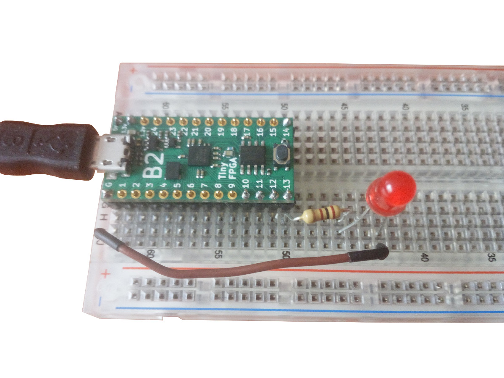

Simple example for testing the TinyFPGA-B2 board
It just blinks the led connected to pin 13

## Hardware setup



## Instructions

* Press the reset **button** on the **TinyFPGA-B2** board
* Execute the following command:

```sh
apio upload
```
This is a fragment of what will be written in the **console**:

```
Board: TinyFPGA-B2
[Thu Jan  4 12:04:42 2018] Processing TinyFPGA-B2
--------------------------------------------------------------------------------
FPGA_SIZE: 8k
FPGA_TYPE: lp
FPGA_PACK: cm81
PROG: tinyfpgab -c /dev/ttyACM0 --program
yosys -p "synth_ice40 -blif hardware.blif" -q Blink13.v
arachne-pnr -d 8k -P cm81 -p TinyFPGA-B2-pins.pcf -o hardware.asc hardware.blif
[...]
icepack hardware.asc hardware.bin
tinyfpgab -c /dev/ttyACM0 --program hardware.bin

TinyFPGA B-series Programmer CLI
--------------------------------
Using device id 1209:2100
Programming /dev/ttyACM0 with hardware.bin
Bootloader not active
Programming at addr 030000
Waking up SPI flash
135100 bytes to program
Erasing designated flash pages
Writing bitstream
Verifying bitstream
Success!
========================= [SUCCESS] Took 7.05 seconds =========================
```

After 10 seconds or so, the led will **blink**
