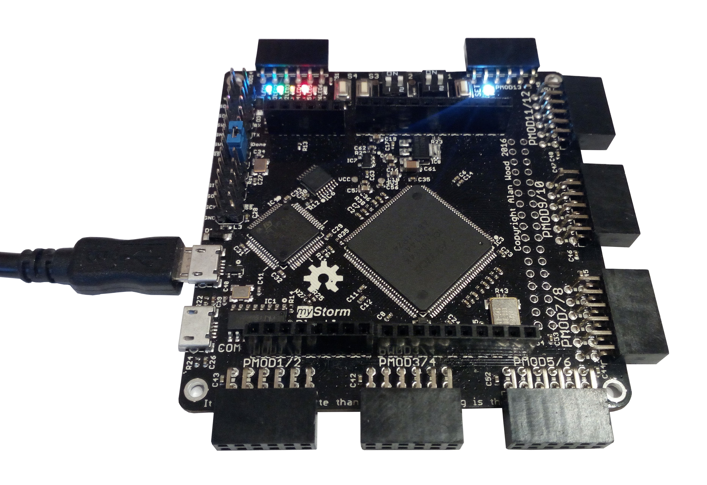

Simple example for testing the mystorm Blackice board
It just blinks the red led 4

## Hardware setup



## Instructions

* Connect the board to the computer (USB shown in the above picture)
* Execute the following command:

```sh
apio upload
```
This is a fragment of what will be written in the **console**:

```
Board: blackice
[Thu Jan  4 17:52:41 2018] Processing blackice
--------------------------------------------------------------------------------
FPGA_SIZE: 8k
FPGA_TYPE: hx
FPGA_PACK: tq144:4k
PROG: black-iceprog /dev/ttyACM0
yosys -p "synth_ice40 -blif hardware.blif" -q blink.v
arachne-pnr -d 8k -P tq144:4k -p blink.pcf -o hardware.asc hardware.blif
[...]
icepack hardware.asc hardware.bin
black-iceprog /dev/ttyACM0 hardware.bin
Wrote 135100 bytes
========================= [SUCCESS] Took 3.77 seconds =========================
```

After 4 seconds or so, the red led will be **blinking**
